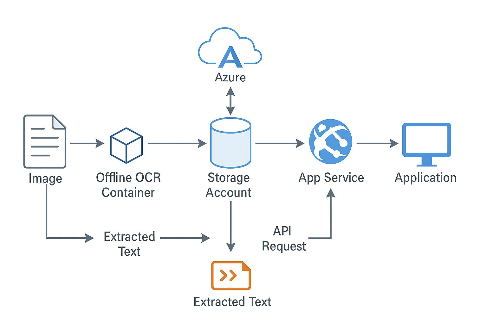

# Azure OCR Offline Deployment

This project demonstrates the deployment of **Azure Cognitive Services OCR** in a secure, air-gapped, on-premises environment using Docker.

---

## 🚀 Features
- Offline OCR AI service (no internet required)
- Secure deployment in air-gapped environments (e.g., banking)
- Docker Compose based container orchestration
- Automated document recognition while ensuring compliance and data privacy

---

## 🏗️ Architecture

Below is the high-level architecture of the offline OCR deployment:



---

## 📖 Deployment Guide

### 1. Prerequisites
- Docker installed on the host system  
- Docker Compose installed  
- Offline package of Azure Cognitive Services OCR container (provided by Microsoft)  

### 2. Clone the Repository
```bash
git clone https://github.com/musaib70/Azure-OCR-Offline-Deployment.git
cd Azure-OCR-Offline-Deployment
```

### 3. Run Locally

Build and run the OCR service locally:
```bash
docker-compose up --build -d
```
Then open your browser and navigate to:
👉 http://localhost:8000

4. Document Processing

- Place input files in the upload/ folder
- OCR service processes the documents automatically
- Extracted text & JSON results are stored in the output/ folder

### 5. Stop the Services
```bash
docker-compose down
```
